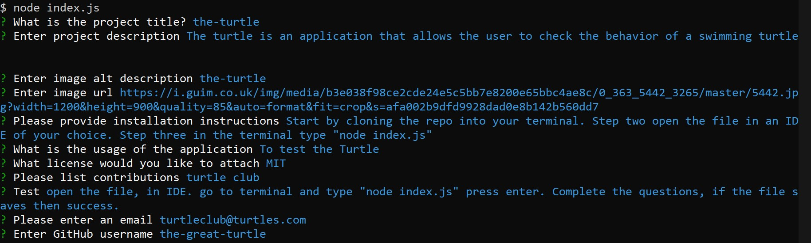

# readme-generator      [](https://opensource.org/licenses/MIT)
## Description 
The following application is one that allows the user to quickly generate a README file utilizing JavaScript, by simply typing node index.js in the terminal. Once the user inputs the command, they are then prompted with questions related to the title, description, usage,instructions, license, questions, contributions, and images. Once all the information is collected, there will then be a new file located in the folder. This is the README document.





# Table of Contents
- [Instructions](#instructions)
- [Usage](#usage)
- [License](#license)
- [Contributions](#contributions)
- [Test](#test)
- [Questions](#questions)
## Instructions
start by cloning the repository through your terminal, locate the file and open it in an IDE of you choice. Then open your terminal and type "node index.js" and press enter. Then proceed to answer the questions. Modifications can be made to the README file if desired.
## Walkthrough video
[click to watch](https://drive.google.com/file/d/18n4_EKJHa30JfgVxnPL8ZY62dMZpgeOh/view?usp=sharing)
## Usage
To generate a README file with strict guidelines
## License
* [License: MIT](https://opensource.org/licenses/MIT) : click to learn more
## Contributions
Inquirer
```
function writeToFile(fileName, data) {
    fs.writeFile(fileName+'.md',data, (err)=>{
        if (err) throw err;
        console.log('file saved')
    });
}
```
This code snippet played a key role in creating and saving the new readme file once all the answers are filled in. 
## Test
Load file and open terminal. Then type "node index.js" to start the application. File should save to computer when completed.
### Questions
For questions proceed to:
* [richardfpro864@gmail.com](mailto:richardfpro864@gmail.com)
* [rich-f-p](https://github.com/rich-f-p)